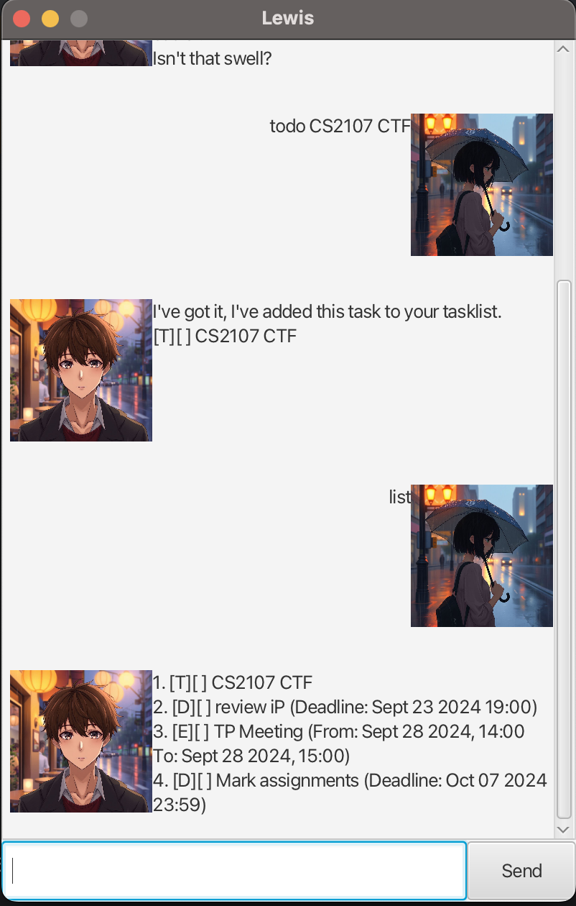

Lewis User Guide
-------------------------------------------------------

Lewis the chatterbox is an interactive application for managing tasks. It offers a
user-friendly and interactive way to manage to-dos, deadlines, and events. Lewis
does the thinking for you, and keeps you on track of your **immediate priorities**.

-------------------------------------------------------

## Quick Start

1. Ensure you have [Java `17` or above](https://www.oracle.com/java/technologies/downloads/) installed in your system.

1. Download the latest `.jar` file from [here](https://github.com/darkmoongreatsword/ip/releases).

1. Copy the file to the folder you want to use as the _home folder_.

1. Open a command terminal.  For MacOS users: 
   - <kbd>⌘</kbd>+<kbd>Space</kbd>
   - Search 'Terminal' 
   
   For  Windows users:
   - <kbd></kbd>
   - Search 'cmd'

1. Type the command into the text box.  Hit enter or
   click the 'Send' button whenever you're ready.  Here are some commands you can try!

    * `help` : Lists all commands.  

    * `todo finish work` : Adds a task named `read book` to the task list.  

    * `find Aug` : Finds all tasks that contain `Aug` 

    * `bye` : Exits the app.  

1. Refer to the [Features](#features) below for details of each command.

-------------------------------------------------------

## Features

### Getting help: `help`

Shows all commands, what they do and their usage.

-------------------------------------------------------

### Adding a to-do: `todo`

Adds a task to do to the task list. 

Usage: `todo <task>`

Examples: 
- `todo watch lecture`
- `todo research about whales`

-------------------------------------------------------

### Adding a deadline: `deadline`

Adds a task with a deadline.

Usage: `deadline <task> /by <YYYY-MM-DD> <HH:MM>`

If the time is not specified, it will be set to 23:59

Examples:
- `deadline submit CS2106 lab /by 2024-09-23`
- `deadline marine research /by 2024-09-23 16:00`

-------------------------------------------------------

### Adding an event: `event`

Adds a task with a starting and end date and time.

Usage: `event <task> /from <YYYY-MM-DD> <HH:MM> /to <YYYY-MM-DD> <HH:MM>`

Time must be specified.

Examples:
- `event marine research meeting /from 2024-09-26 14:00 /to 2024-09-26 16:00`
- `event company R&R /from 2024-09-30 08:00 /to 2024-09-30 16:00`

-------------------------------------------------------

### Viewing all tasks `list`

Shows all tasks, with the most important being at the top.

Usage: `list`

-------------------------------------------------------

### Finding a task: `find`

Shows all tasks that match the given keyword.

Usage: `find <keyword>`

Examples:
- `find Aug` shows all tasks that contain `Aug`
- `find Math` shows all tasks that contain `Math`

-------------------------------------------------------

### Marking a task as done: `mark`

Marks a task as done.

Usage: `mark <index>`

To see what index a task has, use `list` or `find`.

Example:
- `mark 1` marks the 1st task as done.

-------------------------------------------------------

### Marking a task as undone: `unmark`

Unmarks a task as done.

Usage: `unmark <index>`

To see what index a task has, use `list` or `find`.

Example:
- `mark 1` unmarks the 1st task as done.

-------------------------------------------------------

### Deleting a task

Removes the task from the tasklist.

Usage: `delete <index>`

To see what index a task has, use `list` or `find`.

Example:
-`delete 2` deletes the 2nd task from the current list.

-------------------------------------------------------

### Exiting the program: `bye`

Exits the program.

Usage: `bye`,`exit`

-------------------------------------------------------

### Save data

Task data is updated automatically with any data-mutating operation.
There is no manual saving functionality.

-------------------------------------------------------

### Exporting the save file

Your save file is saved as a csv file `[jar file location]/data/tasks.csv`
You may export it for use in another program like Microsoft Excel.

**Caution**: Editing the save file may corrupt it, and Lewis will destroy any corrupted save files that he cannot read.

-------------------------------------------------------

## Command summary

| Action                  | Format, Examples                                                                                                                   |
|-------------------------|------------------------------------------------------------------------------------------------------------------------------------|
| **Add To-Do**            | `todo <task>`   e.g., `todo do homework`                                                                                        |
| **Add Deadline**         | `deadline <task> /by <date> <time>`   e.g., `deadline submit assignment /by 2024-09-24 12:00`                                   |
| **Add Event**            | `event <task> /from <date> <time /to <date> <time>`   e.g., `event company meeting /from 2024-09-30 14:00 /to 2024-09-30 16:00` |
| **List All Tasks**       | `list`                                                                                                                             |
| **Mark Task as Done**    | `mark <index>`   e.g., `mark 4`                                                                                                 |
| **Unmark Task**          | `unmark <index>`   e.g., `unmark 1`                                                                                             |
| **Delete Task**          | `delete <index>`   e.g., `delete 5`                                                                                             |
| **Find Tasks**           | `find <keyword>`   e.g., `find maths`                                                                                           |
| **Exit**                 | `bye`,`exit`                                                                                                                       |
| **Help**                 | `help`                                                                                                                             |

-------------------------------------------------------

## Acknowledgements

GUI Images for Lewis and User are created using Stable Diffusion by Stability AI

Overall layout for this User Guide adapted from [@JunLongling](https://junlongling.github.io/ip/)

